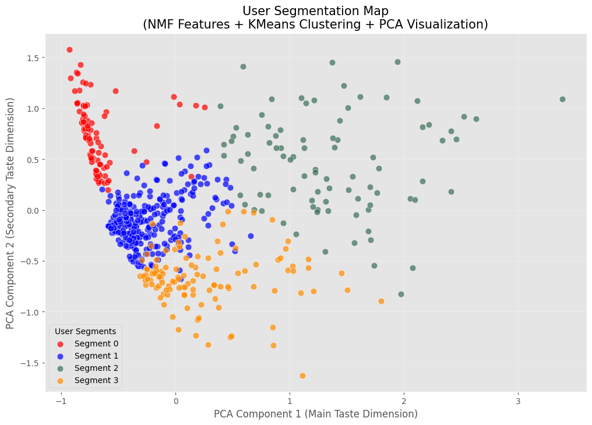

# User Persona Analysis: Decoding Hidden Movie Tastes with NMF & Clustering

This project analyzes user movie-watching preferences using collaborative filtering and unsupervised learning techniques.

## Key Implementation

The project deconstructs the MovieLens Latest Small Dataset to identify latent user personas through three primary stages:

Feature Extraction: Applying Non-negative Matrix Factorization (NMF) to decompose ratings into 6 latent "Content Genes".

User Clustering: Segmenting users into 4 distinct groups using K-Means. 

Visualization (PCA): Using Principal Component Analysis (PCA) to map complex, 6-dimensional user tastes into a 2D "User Segmentation Map" for intuitive analysis. 

## Results & Insights

### 1. User Segmentation Map

This visualization is the core result of PCA-driven dimensionality reduction, mapping high-dimensional taste profiles onto a 2-axis coordinate system.



**PCA Axis Interpretation:**
* **PC1 (X-Axis) - Mainstream Accessibility**: Distinguishes between mainstream movies and specific subcultures.
* **PC2 (Y-Axis) - Cinematic Style Spectrum**: Captures the variation from family-friendly animation to darker cult classics.


### 2. Full Analysis & Deep Dive

For a detailed look at the 6 Hidden Content Genes and comprehensive persona summaries, please refer to my **[Project Slides (PDF)](./project_slides.pdf)**.

## Techniques Used

Matrix Factorization (NMF)

K-Means Clustering

Principal Component Analysis (PCA)

Data visualization with Matplotlib & Seaborn

## Libraries

pandas, numpy, scikit-learn, matplotlib, seaborn

## Project Structure

```text
├── data/                  # Source data: movies.csv, ratings.csv 
├── Persona_Analysis.ipynb  # Core implementation
├── user_segmentation_map.png  # 2D User Segmentation Map generated via PCA 
├── project_slides.pdf    # Full analysis and business insights 
└── README.md              # Project overview and guide 
